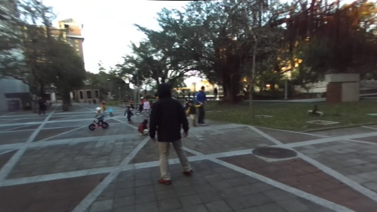
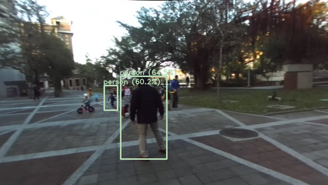

# Edge-TPU YOLOv3-Tiny Convert & Run

## Introduction
This repository is the model conversion process of Edge-TPU M.2 or Mini PCIe Accelerator.
In order to run the model on Edge-TPU, it must be converted to full quantized TensorFlow-Lite model.
The following are the model conversion steps, including:
1. Convert Darknet model `.weights` to TensorFlow frozen graph `.pb`.
2. Convert Tensorflow frozen graph `.pb` to TF-lite model `.tflite`.
3. Compile a TF-Lite model `.tflite` into a file that's compatible with the Edge TPU `_edgetpu.tflite`.

**P.S.** Since different versions of tensotflow will be used, it is recommended to use [Anaconda](https://www.anaconda.com/download/) to create environments of different versions.

## Step1 Darknet2Frozen
### Setup
Assuming a fresh Anaconda distribution with Python 3.6.12, you can install the dependencies with:
```
pip install numpy pillow
pip install tensorflow==1.12.0
pip install  opencv-python==4.1.2.30
```
### Convert
Get information required for conversion with:
```
python generate_model_params.py -i $CFG -l $CLASS_NAME -o InputData/
```
Then convert `.weights` to `.pb` by using:
```
python convert_weights_pb.py --class_names $CLASS_NAME --weights_file $WEIGHTS_FILE --data_format NHWC --output_graph $OUTPUT_GRAPH --size $SIZE --tiny --model_config $CFG
```
### Demo
If you want to check the result with the conversion model, you can use:
```
python demo_tiny_yolo_tf.py -m $OUTPUT_GRAPH -I $INPUT_IMAGE -O $OUTPUT_IMAGE --params $PARAMS -l $LABELS -pt 0.5 -iout 0.5
```

## Step2 Frozen2tflite
### Setup
To inference with quantized TF-lite model, first of all, you need to install TensorFlow or TensorFlow-Lite with:
```
pip install tensorflow==2.2.0
```
Or 
```
pip install tflite-runtime==2.5.0
```
**P.S.** In this step, you can also create another environment to convert the model.
### Convert
Convert `.pb` to `.tflite` by using:
```
python convert_frozen_model_to_tflite.py -m $PB_MODEL -o $TFLITE_MODEL --params $PARAMS
```
### Demo
Check the result by using:
```
python demo_tiny_yolo_tflite.py -m $TFLITE_MODEL -I $INPUT_IMAGE --params $PARAMS -l $LABEL -pt 0.5 -iout 0.5 -O $OUTPUT_IMAGE
```
Or
```
python yolov3_tiny_tflite_demo.py --model $TFLITE_MODEL --anchors $ANCHOR --classes $NAMES -t 0.5 --quant --image $INPUT_IMAGE
```
**P.S.** `$PARAMS` `--$LABEL` is the parameter from step1
## Step3 EdgeTPUCompiler
In this step, we provided two [Docker](https://www.docker.com/) images to build the `edgetpu_compiler` environment and compile `.tflite` into `_edgetpu.tflite`.
You can just run `run_docker_TPUCompiler.cmd` to do those things.
Or you can use `dockerfileBUILD` and `dockerfileRUN` to build the environment and compile model step by step, by using:
```
docker build --no-cache -t edge_tpu_compiler:build -f DockerfileBUILD .
docker build --no-cache -t edge_tpu_compiler:run -f DockerfileRUN .
```
Then copy back all the result from container.

## Reference
1. [Convert YOLOv3-Tiny to tensorflow model](https://github.com/mystic123/tensorflow-yolo-v3)
2. [Compile and deploy YOLOv3-Tiny models for CoralDevBoard/TinkerEdgeT](https://github.com/KodeWorker/EdgeTPU-YOLOv3-Tiny)
3. [Run Tiny YOLO-v3 on Google's Edge TPU USB Accelerator.](https://github.com/guichristmann/edge-tpu-tiny-yolo)
4. [Get started with the M.2 or Mini PCIe Accelerator](https://coral.ai/docs/m2/get-started/)
